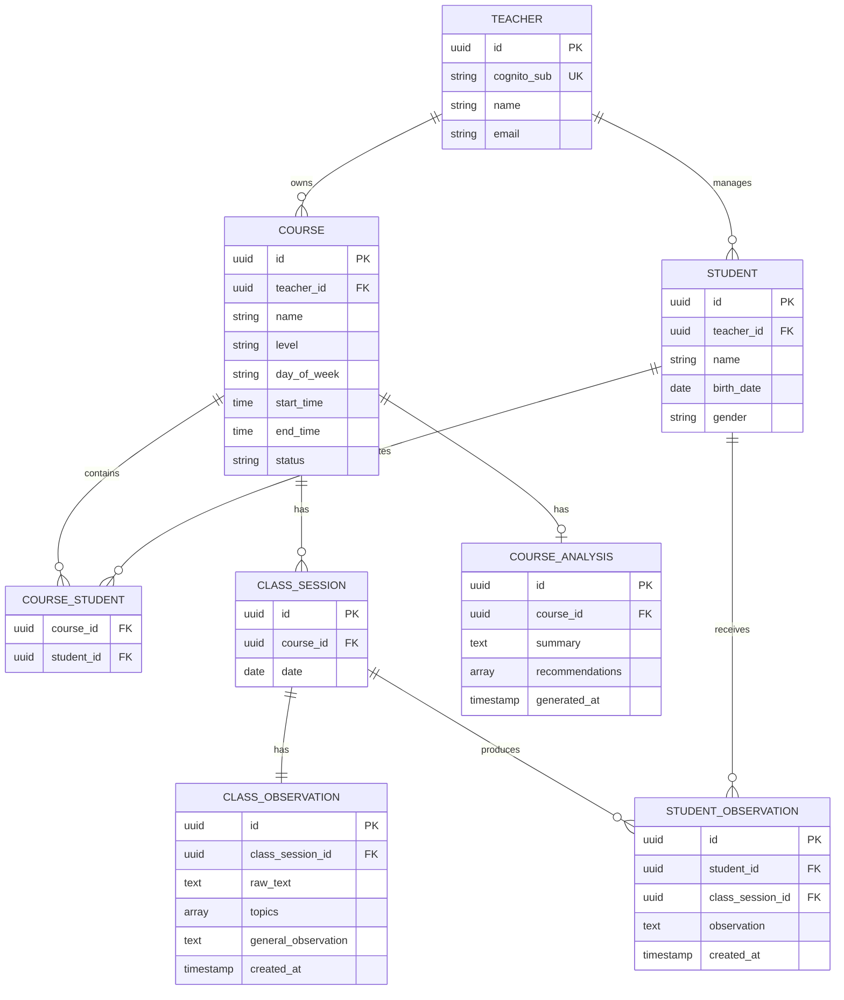

# EduX — Modelo de datos del MVP

**Base:** [Especificación funcional del MVP](functional-specification.md)  
**Propósito:** definir el modelo conceptual y lógico de datos necesario para implementar el MVP de EduX, sin establecer todavía el DDL definitivo de PostgreSQL ni las migraciones de Supabase.

---

## 1. Objetivo

El modelo de datos debe permitir representar de forma simple:

- docentes autenticados;
- cursos o comisiones;
- alumnos y su participación en cursos;
- encuentros concretos de cada curso;
- registros docentes escritos en lenguaje natural;
- información estructurada extraída mediante IA;
- historiales individuales de alumnos;
- último análisis general generado para cada curso.

El modelo prioriza simplicidad para el MVP y evita crear entidades que todavía no aportan valor funcional.

La especificación funcional distingue explícitamente entre curso recurrente, encuentro concreto, registro docente, observaciones derivadas y análisis acumulado del curso.

---

## 2. Consideraciones generales

### 2.1 Autenticación

AWS Cognito será responsable de autenticar a los docentes.

Supabase se utilizará como servicio administrado de PostgreSQL y no como proveedor de autenticación.

La entidad `Teacher` representa dentro del dominio al usuario autenticado en Cognito.

Cada docente tendrá un identificador externo `cognito_sub`, correspondiente al identificador único provisto por Cognito.

```text
AWS Cognito
     |
     | cognito_sub
     v
Teacher
```

Esto permite mantener desacoplada la identidad externa de las entidades del dominio.

---

## 3. Entidades

### 3.1 Teacher

Representa a una docente autenticada que utiliza EduX.

```text
Teacher
- id
- cognito_sub
- name
- email
```

#### Responsabilidad

- Identificar a la docente dentro del dominio.
- Vincular los cursos y alumnos que administra.
- Relacionar el usuario autenticado en Cognito con los datos almacenados en PostgreSQL.

#### Restricciones

```text
cognito_sub UNIQUE
```

Cada usuario autenticado representa una única docente dentro del MVP.

---

### 3.2 Course

Representa un curso o comisión con continuidad en el tiempo.

Ejemplos:

```text
Spike Nivel 1 — jueves — Milagros
Spike Nivel 1 — lunes — Laura
```

Aunque ambos tengan el mismo nombre, son cursos distintos porque corresponden a diferentes docentes, horarios y alumnos.

```text
Course
- id
- teacher_id
- name
- level
- day_of_week
- start_time
- end_time
- status
```

#### Responsabilidad

- Agrupar alumnos.
- Definir el horario habitual.
- Agrupar los encuentros realizados.
- Servir como unidad para consultar evolución y generar análisis.

#### Relaciones

```text
Teacher 1 ---- N Course
```

Cada curso pertenece a una única docente.

#### Estado

`status` permite representar:

```text
active
inactive
```

Un curso inactivo conserva sus alumnos vinculados, encuentros e historial para consulta, pero deja de considerarse vigente. Desactivarlo no elimina su información.

La especificación funcional contempla explícitamente cursos activos e inactivos.

---

### 3.3 Student

Representa a un alumno registrado por una docente.

```text
Student
- id
- teacher_id
- name
- birth_date
- gender
```

#### Responsabilidad

- Mantener los datos básicos del alumno.
- Permitir su asociación con uno o más cursos.
- Servir como referencia para las observaciones individuales.

No se guarda la edad directamente. Se obtiene a partir de `birth_date`.

#### Relaciones

```text
Teacher 1 ---- N Student
```

Un alumno pertenece al espacio de una única docente dentro del MVP.

Ese alumno puede participar en varios cursos de esa misma docente.

---

### 3.4 CourseStudent

Representa la relación muchos-a-muchos entre cursos y alumnos.

```text
CourseStudent
- course_id
- student_id
```

#### Relaciones

```text
Course N ---- N Student
```

implementada mediante:

```text
Course
   |
CourseStudent
   |
Student
```

#### Restricción

```text
UNIQUE(course_id, student_id)
```

Un alumno no puede vincularse dos veces al mismo curso.

No se mantiene historial de altas o bajas durante el MVP. La relación existe o no existe.

---

### 3.5 ClassSession

Representa una ocurrencia concreta de un curso.

Por ejemplo:

```text
Curso:
Arduino Nivel 1
jueves 18:00

Encuentros:
01/10/2026
08/10/2026
15/10/2026
```

```text
ClassSession
- id
- course_id
- date
```

#### Responsabilidad

- Identificar una clase concreta del historial de un curso.
- Servir como contexto para el registro docente y las observaciones individuales.

#### Relaciones

```text
Course 1 ---- N ClassSession
```

#### Restricción

```text
UNIQUE(course_id, date)
```

No puede existir más de un encuentro del mismo curso en la misma fecha.

#### Decisión de diseño

`ClassSession` no almacena hora ni estado.

La hora pertenece a `Course`, porque representa el horario habitual.

La existencia de una `ClassSession` indica que hubo un encuentro registrado. No se modelan para el MVP estados como:

```text
scheduled
completed
cancelled
```

La especificación define al encuentro como una ocurrencia concreta de un curso identificada por fecha.

---

### 3.6 ClassObservation

Representa el registro escrito por la docente sobre un encuentro y los datos generales extraídos mediante IA.

```text
ClassObservation
- id
- class_session_id
- raw_text
- topics[]
- general_observation
- created_at
```

#### Responsabilidad

Conservar:

1. el texto original escrito por la docente;
2. los temas identificados por IA;
3. una posible observación general sobre la clase o el grupo.

Ejemplo:

```text
raw_text:
"Hoy vimos sensores ultrasónicos. El grupo participó mucho
y a Juan le costó completar la actividad."

topics:
["Sensores ultrasónicos"]

general_observation:
"El grupo participó activamente."
```

#### Relaciones

```text
ClassSession 1 ---- 1 ClassObservation
```

#### Restricción

```text
UNIQUE(class_session_id)
```

Cada encuentro admite un único registro docente.

Esto corresponde a la regla funcional definida para el flujo de registro.

#### Representación de valores vacíos

Después de una extracción completada, la ausencia de información relevante se representa así:

| Salida funcional | Representación en el modelo |
| --- | --- |
| `topics: []` | `ClassObservation.topics` contiene una colección vacía, no un valor nulo. |
| `generalObservation: null` | `ClassObservation.general_observation` admite un valor nulo; no se guarda un texto artificial ni una cadena vacía para suplirlo. |
| `studentObservations: []` | No se crean filas de `StudentObservation` para el encuentro. |

El registro `ClassObservation` y su `raw_text` se conservan aunque las tres categorías estén vacías. Estos valores expresan ausencia de información extraída; no indican que el procesamiento esté pendiente o haya fallado. El tratamiento de fallos y reintentos sigue pendiente de definición funcional.

---

### 3.7 StudentObservation

Representa una observación individual detectada por IA sobre un alumno en un encuentro concreto.

```text
StudentObservation
- id
- student_id
- class_session_id
- observation
- created_at
```

#### Ejemplo

```text
Student: Juan

Observation:
"Presentó dificultades para conectar correctamente
el sensor ultrasónico."
```

#### Relaciones

```text
Student 1 ---- N StudentObservation

ClassSession 1 ---- N StudentObservation
```

#### Restricción

```text
UNIQUE(class_session_id, student_id)
```

Para simplificar el MVP, se conserva como máximo una observación consolidada por alumno y encuentro.

Si el texto docente contiene varias observaciones sobre el mismo alumno, la salida estructurada de IA deberá consolidarlas.

---

## 4. Topics como atributo

No existe una entidad `ClassTopic` en el MVP.

Los temas extraídos se guardan dentro de `ClassObservation` como una colección:

```text
topics[]
```

Ejemplo:

```json
[
  "Sensores ultrasónicos",
  "Medición de distancia"
]
```

### Motivo

Por el momento, los temas:

- no poseen atributos propios;
- no tienen ciclo de vida independiente;
- no requieren administración manual;
- no necesitan relacionarse directamente con otras entidades.

Crear una entidad independiente introduciría complejidad sin necesidad funcional actual.

Si en el futuro EduX necesita consultas avanzadas como:

```text
"Mostrar todas las clases donde se trabajó sensores"
```

o:

```text
"Analizar la evolución de un alumno para un tema concreto"
```

podrá evaluarse su normalización.

---

## 5. Historial individual del alumno

No existe una entidad `StudentRecord`.

El historial de un alumno se obtiene consultando sus `StudentObservation`.

```text
Student
   |
   ├── StudentObservation
   ├── StudentObservation
   ├── StudentObservation
   └── StudentObservation
```

Cada observación mantiene su contexto a través de `ClassSession` y `Course`.

Esto permite reconstruir:

```text
Juan

01/09 — Arduino Nivel 1
"Tuvo dificultades para conectar el sensor."

08/09 — Arduino Nivel 1
"Necesitó menos ayuda durante la actividad."

15/09 — Arduino Nivel 1
"Completó correctamente el ejercicio."
```

La especificación funcional define el historial individual como el conjunto cronológico de observaciones, sin requerir un texto acumulativo persistido.

---

## 6. CourseAnalysis

Representa el último análisis general solicitado por la docente para un curso.

```text
CourseAnalysis
- id
- course_id
- summary
- recommendations[]
- generated_at
```

### Summary

`summary` representa una síntesis de la evolución general del curso.

Responde conceptualmente:

> ¿Cómo viene el grupo?

Ejemplo:

```text
"El grupo mostró una buena comprensión de los conceptos
iniciales de Arduino. Las principales dificultades recientes
se encuentran en actividades relacionadas con sensores,
aunque se observa una mejora progresiva."
```

### Recommendations

`recommendations` contiene cero o más propuestas para próximos encuentros.

Ejemplo:

```json
[
  "Realizar un breve repaso sobre conexión de sensores.",
  "Incluir una actividad guiada antes del ejercicio individual."
]
```

Las recomendaciones no son obligatorias. Si el análisis no produce propuestas sustentadas, `recommendations` contiene una colección vacía (`[]`), no un valor nulo. Si el curso no tiene registros, se informa que no hay base para analizar y no se crea una fila de `CourseAnalysis` con contenido vacío.

### generated_at y alcance del análisis

`generated_at` conserva la fecha y hora en que se generó el resultado guardado. Permite que la UI muestre **«Último análisis de IA: [fecha]»** junto al resumen y las recomendaciones.

Para el MVP se considera todo el historial disponible del curso al iniciar la generación. La fecha mostrada corresponde a la generación del resultado, no a la fecha del último encuentro incluido.

No se implementa selección manual de rangos o sesiones, ni se conserva una instantánea o lista de los registros analizados. No se necesita un atributo adicional `analyzed_until` para mostrar la fecha del último análisis: ese propósito queda cubierto por `generated_at`.

Los registros agregados después, incluso con fechas de encuentro anteriores, no modifican el análisis guardado ni `generated_at`. Una nueva solicitud genera un resultado que reemplaza al anterior y actualiza su fecha de generación.

#### Relaciones

```text
Course 1 ---- 0..1 CourseAnalysis
```

#### Restricción

```text
UNIQUE(course_id)
```

Solo se guarda el último análisis.

Cuando se genera uno nuevo, reemplaza el existente.

Esto corresponde con el comportamiento definido en la especificación funcional.

---

## 7. Separación entre información humana e IA

El modelo mantiene separados los datos ingresados por la docente y los datos derivados por IA.

```text
Docente
   |
   v
raw_text
   |
   v
Bedrock
   |
   +--> topics[]
   |
   +--> general_observation
   |
   +--> StudentObservation[]
```

### Datos humanos

```text
Teacher
Course
Student
CourseStudent
ClassSession
ClassObservation.raw_text
```

### Datos derivados por IA

```text
ClassObservation.topics
ClassObservation.general_observation
StudentObservation
CourseAnalysis.summary
CourseAnalysis.recommendations
```

El texto original nunca es reemplazado por la interpretación de IA.

La especificación establece esta separación de procedencia explícitamente.

---

## 8. Diagrama entidad-relación



---

## 9. Cardinalidades

| Relación | Cardinalidad | Descripción |
| --- | --- | --- |
| Teacher → Course | 1:N | Una docente administra varios cursos. |
| Teacher → Student | 1:N | Una docente registra varios alumnos. |
| Course ↔ Student | N:M | Un curso contiene varios alumnos y un alumno puede participar en varios cursos. |
| Course → ClassSession | 1:N | Un curso puede tener varios encuentros. |
| ClassSession → ClassObservation | 1:1 | Cada encuentro admite un único registro docente. |
| ClassSession → StudentObservation | 1:N | De un encuentro pueden surgir observaciones individuales para distintos alumnos. |
| Student → StudentObservation | 1:N | Un alumno puede acumular observaciones de múltiples encuentros. |
| Course → CourseAnalysis | 1:0..1 | Un curso puede no tener análisis todavía o conservar únicamente el último. |

---

## 10. Restricciones principales

```text
Teacher
UNIQUE(cognito_sub)

CourseStudent
UNIQUE(course_id, student_id)

ClassSession
UNIQUE(course_id, date)

ClassObservation
UNIQUE(class_session_id)

StudentObservation
UNIQUE(class_session_id, student_id)

CourseAnalysis
UNIQUE(course_id)
```

Estas restricciones representan reglas del dominio y deberían aplicarse posteriormente también a nivel PostgreSQL.

---

## 11. Decisiones de diseño

### No se utiliza Supabase Auth

La autenticación queda en AWS Cognito.

Supabase se utiliza como PostgreSQL administrado.

---

### No existe ClassTopic

Los temas no poseen identidad propia dentro del MVP.

Se almacenan como colección en:

```text
ClassObservation.topics[]
```

---

### No existe StudentRecord

El historial individual se obtiene de las filas de:

```text
StudentObservation
```

---

### ClassSession no representa una agenda

Solo representa encuentros que existen dentro del historial.

No almacena:

```text
status
start_time
end_time
```

El horario habitual pertenece a `Course`.

---

### Course mantiene estado

`Course.status` permite desactivar una comisión sin eliminar su información histórica.

---

### Solo existe una observación por alumno y encuentro

Para reducir complejidad se consolidan todas las menciones relevantes de un alumno en una única `StudentObservation` para la sesión.

---

### Solo se conserva el último análisis del curso

`CourseAnalysis` no mantiene versionado.

Cada análisis nuevo reemplaza al anterior.

---

## 12. Consideraciones para PostgreSQL / Supabase

La implementación física posterior deberá considerar:

- identificadores UUID;
- foreign keys;
- restricciones `NOT NULL`;
- restricciones `UNIQUE`;
- timestamps;
- eliminación y actualización referencial;
- almacenamiento adecuado para colecciones como `topics` y `recommendations`;
- índices para consultas frecuentes;
- aislamiento de datos por docente.

La elección concreta entre tipos como:

```text
TEXT[]
JSONB
ENUM
VARCHAR
```

queda fuera del alcance de este documento y deberá definirse al diseñar el esquema físico.

---

## 13. Fuera del modelo actual

No se modelan en el MVP:

- historial de altas y bajas de alumnos en cursos;
- asistencia;
- calificaciones;
- agenda detallada;
- sesiones futuras precreadas;
- estados de sesión;
- tópicos como catálogo independiente;
- análisis individuales de alumnos;
- historial de análisis del curso;
- planificación automática de clases;
- múltiples docentes compartiendo un curso.
